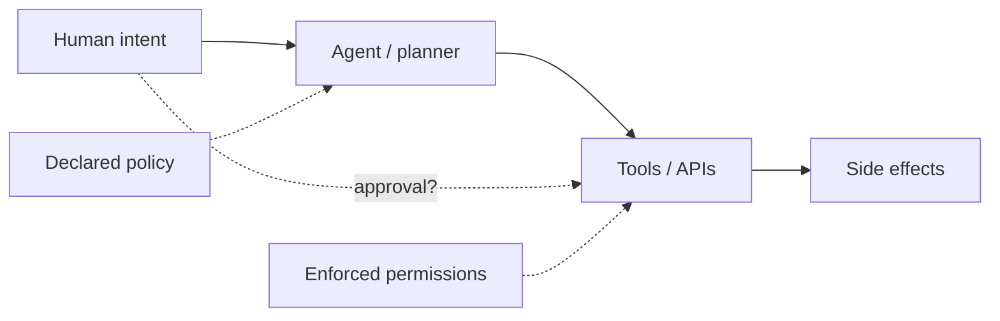

# AURA discovery checklist

Use while scanning; not every item applies to every repo.

## Architecture

- [ ] User-facing chat or API that invokes an LLM with tools
- [ ] Multi-step agent loop (plan → act → observe)
- [ ] Subagents, handoffs, or agent-to-agent messages
- [ ] Background workers that call models without live user session
- [ ] Event-driven triggers (webhook, queue, cron)

## Agency signals

- [ ] Tool calls not tied 1:1 to explicit user messages
- [ ] Retry / replan loops that escalate scope
- [ ] Autonomous "fix it" or "keep healthy" style objectives
- [ ] Write operations on git, tickets, infra, payments, email
- [ ] Dynamic tool or permission expansion at runtime

## Authority signals

- [ ] Service accounts, API keys, kubeconfig, cloud IAM bindings
- [ ] MCP server tool lists vs server-side enforcement
- [ ] `execute_sql`, shell, `eval`, arbitrary HTTP clients
- [ ] Broad filesystem or repo write access
- [ ] Staging-only policy with production-capable credentials

## Understanding signals

- [ ] Approval or review UI components
- [ ] What data is shown before confirm (diff, costs, targets, tests)
- [ ] Logging of model rationale vs user-visible summary
- [ ] Redaction or truncation that hides blast radius

## Accountability signals

- [ ] Structured audit logs (who, what, agent id, correlation id)
- [ ] Shared vs per-user credentials for approved actions
- [ ] Rollback, undo, compensating APIs
- [ ] Kill switch, disable agent, revoke token
- [ ] Separation of duties (approver ≠ deployer ≠ credential owner)

## Intervention verification

For each approval gate found:

- [ ] Does reject block the downstream API/job?
- [ ] Can the agent complete the action via another path (retry queue, direct credential)?
- [ ] Is approval after irreversible steps (already merged, already sent)?

## Graph sketch (mental model)

Mismatch between `Policy` and `Enforce` is a primary Authority finding.
